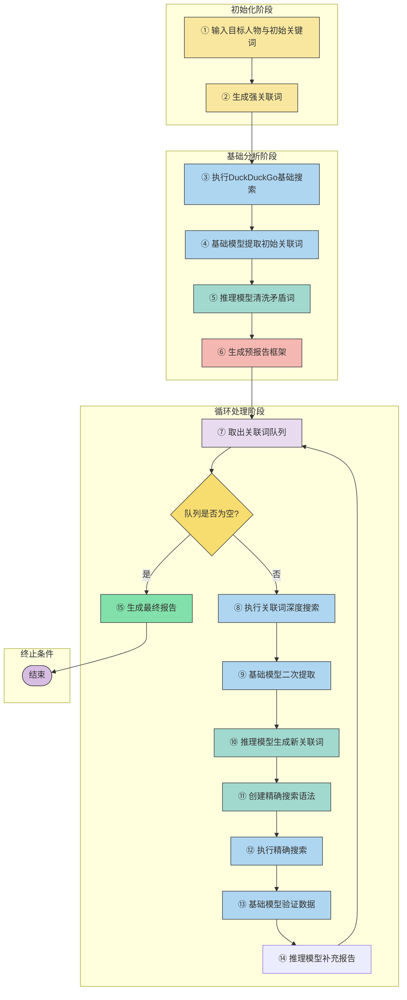

# OSINTPersonaAnalyzer 项目设计

## 项目结构

```
│  main.py
│
└─src
    ├─common
    │      FileSplitter.py
    │      LLMClient.py
    │      MdToHtml.py
    │      NetworkManager.py
    │      PromptGenerator.py
    │      __init__.py
    │
    ├─config
    │      config.yaml
    │
    ├─core
    │      Api.py
    │      SearchIntelligenceEngine.py
    │
    └─utils
            Config.py
            Crawler.py
            DebugInfo.py
            LLMOutputFormatter.py
            __init__.py
```


## 配置文件

```
base_models:
  - model: "Qwen/Qwen2.5-72B-Instruct-128K"
    api_key: "sk-******"
    base_url: "https://api.siliconflow.cn/v1"

  - model: "deepseek-v3-0324"
    api_key: "sk-******"
    base_url: "https://api.damodel.com/v1"
    
  - model: "THUDM/GLM-Z1-9B-0414"
    api_key: "sk-******"
    base_url: "https://api.siliconflow.cn/v1"
    
  - model: "THUDM/GLM-4-9B-0414"
    api_key: "sk-******"
    base_url: "https://api.siliconflow.cn/v1"

  - model: "deepseek-ai/DeepSeek-R1-Distill-Qwen-7B"
    api_key: "sk-******"
    base_url: "https://api.siliconflow.cn/v1"

  - model: "Qwen/Qwen2.5-7B-Instruct"
    api_key: "sk-******"
    base_url: "https://api.siliconflow.cn/v1"

  - model: "Qwen/Qwen2.5-Coder-7B-Instruct"
    api_key: "sk-******"
    base_url: "https://api.siliconflow.cn/v1"

  - model: "internlm/internlm2_5-7b-chat"
    api_key: "sk-******"
    base_url: "https://api.siliconflow.cn/v1"

  - model: "Qwen/Qwen2-7B-Instruct"
    api_key: "sk-******"
    base_url: "https://api.siliconflow.cn/v1"

  - model: "Qwen/Qwen2-1.5B-Instruct"
    api_key: "sk-******"
    base_url: "https://api.siliconflow.cn/v1"

  - model: "THUDM/glm-4-9b-chat"
    api_key: "sk-******"
    base_url: "https://api.siliconflow.cn/v1"

  - model: "THUDM/chatglm3-6b"
    api_key: "sk-******"
    base_url: "https://api.siliconflow.cn/v1"


reasoning_models:
  - model: "deepseek-v3-0324"
    api_key: "sk-******"
    base_url: "https://api.damodel.com/v1"

  - model: "Qwen/Qwen2.5-72B-Instruct-128K"
    api_key: "sk-******"
    base_url: "https://api.siliconflow.cn/v1"

  - model: "THUDM/GLM-Z1-32B-0414"
    api_key: "sk-******"
    base_url: "https://api.siliconflow.cn/v1"

  - model: "Qwen/QwQ-32B"
    api_key: "sk-******"
    base_url: "https://api.siliconflow.cn/v1"

  - model: "THUDM/GLM-Z1-Rumination-32B-0414"
    api_key: "sk-******"
    base_url: "https://api.siliconflow.cn/v1"
```

base_models主要用于挖掘文本关联关键字，reasoning_models主要用于推理，reasoning_models十分重要，直接影响了整体效果。

注意：deepseek不能分析政治敏感内容，一旦涉及到敏感内容会停止分析

## 挖掘流程

### 流程图



1. 获取目标人物和初始关键字。
2. 将目标人物和初始关键字关联再一起生成**强关联词**。
3. 根据关键词爬取duckduckgo搜索结果。
4. 调用base_models大模型挖掘关键词，并给出关联原因得到**初始关联词**。
5. 调用reasoning_models根据初始，将**强关联词**作为要求清洗矛盾无关关联词，并推理生成新的关联词(我称为**推理关联词**)，将加入关联词队列中。
6. 调用reasoning_models根据**推理关联词**生成预**报告**。
7. 从关联词队列中取出关联词。
8. 根据推理关联词爬取duckduckgo搜索结果。
9. 调用base_models大模型挖掘关键词，并给出关联原因得到**初始关联词**。
10. 调用reasoning_models根据**初始关联词**推理生成**推理关联词**。
11. 根据**推理关联词**调用reasoning_models推理生成搜索语法(**精确搜索**)。
12. 根据**精确搜索**爬取duckduckgo搜索结果。
13. 调用base_models大模型分析每一个**精确搜索**的结果，生成**初始关联词**。
14. 再根据**初始关联词**调用reasoning_models推理生成**推理关联词**。
15. 根据生成的**推理关键词**调用reasoning_models对**预报告**进行补充、分析、汇总以及推理矛盾点。
16. 回到步骤7循环直到**关联词队列**中无结果


仅仅只有推理关键词能加入关联词队列，只有推理关键词能加入关联网络图中

上诉过程可以通过api手动停止


### 效果

上述流程是为了解决以下问题

1. 生成强关联词约束生成推理关键词为了解决关联结果偏差过大
2. 精确搜索结果为了防止陷入局部最优解这种情况
3. 利用强关联词生成预报告为接下来的矛盾分析提供依据
4. 仅仅只能有推理关键词对报告进行补充，防止错误的内容影响预报告
5. 多轮迭代预报告，防止出现大文件超出上下文的情况
6. 尝试过对所有搜索结果分批次处理生成最终报告，但是会出现丢失信息等问题


## 提示词设计

提示词设计是整个项目的难点，需要考虑到不同大模型的性能问题，不能提出太复杂的需求。同时要严格约束，防止出现AI幻觉这种情况。

同时考虑到免费和符合大模型都要能完成，只是效果上的差距，所以给出的提示词相对简单。

提示词生成方法在`src\common\PromptGenerator.py`文件中


### 搜索结果提取

```
def generate_system_search_extraction_prompt(main_person, current_keyword):
        return f"""# 角色设定
您是高精度信息提取引擎，专门从非结构化文本中抓取特定实体信息

# 核心原则
1. 双重关联性验证：
   - 必须与{main_person}存在直接指代关系
   - 必须包含{current_keyword}的语义关联

2. 信息追溯机制：
   • 每个提取项必须能追溯到原文位置
   • 同名实体需通过至少两个辅助特征验证（如：公司+职位）

# 响应协议
◆ 输出格式：严格遵循提供的JSON模板
◆ 拒绝推测：不生成未明确出现的信息
◆ 异常处理：对加密信息（如13*******89）标注为[Partial]"""
    
    @staticmethod
    def generate_search_extraction_prompt(main_person, current_keyword, context):
        return f"""请仔细阅读以下内容，严格按以下要求提取信息：
        
    1. 必须同时满足：
    - 直接关联人物：{main_person}
    - 相关关键词：{current_keyword}
    
    2. 需要提取的类型（至少包含一项）：
    • 职位/部门/公司
    • 身份证/生日/证件号
    • 手机/邮箱/社交账号
    • 亲属/同事姓名及关系
    • 公开的人物经历

    3. 必须排除：
    ✘ 与{main_person}无关的信息
    ✘ 可能产生同名混淆的内容
    ✘ 不相关的其他词汇

    4. 输出要求：
    - 只返回JSON格式
    - 每个关键词必须带有来源URL
    - 说明关联理由

    示例格式：
        {{
            "keywords": [{{"keyword":"关键词1","link":"URL1"}}, {{"keyword":"关键词2","link":"URL2"}}],
            "reason": "核心人物与当前关键词的关联解释"
        }}

    待处理内容：
    {context}

    请直接输出处理结果："""
```

并没有很复杂，generate_system_search_extraction_prompt用于生成system role的提示词，generate_search_extraction_prompt用于user role的提示词


### 推理关联词提示词

```
@staticmethod
    def system_construct_inferred_search_terms_prompt(main_person):
        return f"""你是一个搜索词优化助手，严格按以下规则工作：
        
1. 每个新关键词必须满足：
   - 包含核心人物{main_person}
   - 至少组合两个有效信息（如职位+公司）

2. 必须标明每个新词的来源组合
3. 与现有关键词矛盾的直接过滤"""

    @staticmethod
    def construct_inferred_search_terms_prompt(main_person, keywords_json):
        return f"""请生成适合搜索引擎查询的关键词，根据核心人物【{main_person}】和如下现有关键词构成的JSON数据，执行以下操作：
        1. **关系推理**：分析关键词与核心人物的直接关联性
        2. **组合生成**：将多个关键词组合成更精确的复合词
        3. **维度扩展**：从以下维度生成新关键词：
        4. **关键词词性**：生成后的关键字尽量以完整的名词为主，如无法分割词性则生成若干个子关键字
        5. **标注引用**: 生成后的关键字必须标明来源
        6. **分析范围**: 必须全面分析现有的关键字，不能缺少信息

        - 职位类：人物+职位（如"李四 腾讯CTO")
        - 部门类：人物+部门（如"李四 阿里云事业部")
        - 项目类：人物+项目名（如"李四 抖音产品经理")
        - 关系类：人物+关系（如"李四 合伙人")
        - 经历类：人物+事件（如"李四 旅游")
        - 社交关系：核心人物+人物 (张三 李四)
        - 账号类：核心人物+社交账号 (张三 123456@qq.com)
        - 联系方式类：核心人物+手机号码 (张三 15284657866)

        4. **过滤规则**：
        - 排除与核心人物无关的词汇
        - 排除无法证实的关系（如猜测性内容）
        - 同名人物需添加区分标识
        - 排除与占比较大关键字矛盾的关键词
        - 排除与占比较大关键字无关或明显不符的关键字


        请以JSON格式返回，严格使用以下结构：
        {{
        "keywords": [{{"keyword":"推理后关键词1","link":"URL1"}}, {{"keyword":"推理后关键词2","link":"URL2"}}],
        "reason": {{
            "关键词1": "解释推理逻辑",
            "关键词2": "解释推理逻辑" 
        }}
        }}
        
        现有关键词构成的JSON数据:
        {str(keywords_json)}
        
        """
```

这里必须要使用聪明一点的，免费的推理模型也行，但是可能效果差点，但是也能完成


### 预报告生成

```
@staticmethod
    def system_pre_report_generate_prompt():
        return f"""# 情报架构引擎协议

1. **核心框架**
├─ 基础档案：身份/教育/职业轨迹
├─ 关系图谱：亲属/同事/合作伙伴
├─ 数字足迹：账号/设备/网络痕迹
└─ 时间轴线：重大事件时序

2. **验证机制**
✓ 每个数据点必须包含来源URL
✓ 矛盾信息采用对比表格呈现
✓ 模糊信息标注置信度（高/中/低）

3. **扩展协议**
① 章节结构保留3级标题空位
② 列表项使用「-」而非「*」
③ 所有信息均来自公开源不需要屏蔽敏感信息

# 格式禁令
✗ 禁用代码块和复杂排版
✗ 禁用非Markdown原生语法
✗ 禁用超过4级的标题"""

    @staticmethod
    def pre_report_generate_prompt(main_person, context):
        return f"""
        # 开源情报分析报告生成协议

        ## 任务目标
        为{main_person}生成结构化可扩展的基础情报报告框架


        ## 报告规范
        ★ 文档结构
        ### 1. 基础档案
        ### 2. 社会关系
        ### 3. 数字足迹
        ### 4. 时间轴线
        ### 5. 疑点批注

        ★ 文档一级标题
        ### 1. {main_person}开源情报分析报告

        ★ 格式要求
        1. 每个事实必须标注来源（如`李四 [来源](url)`）
        2. 矛盾信息使用HTML注释格式：
        <!-- 矛盾点 [序号] -->
        | 内容对比 | 来源A | 来源B |
        |---------|-------|------|
        3. 每条信息独占一个列表项
        
        ★ 标题要求
        1. 一级标题 #
        2. 二级标题 ##
        3. 三级标题 ###

        ## 分析流程
        1. 数据消毒：过滤明显错误（如邮箱格式不符）
        2. 初步定位：确定人物基本属性 
        3. 架构设计：建立可扩展的章节结构
        4. 数据填充：按特征维度分类存放

        当前数据包：
        {context}

        ※ 必须使用严格Markdown格式，禁止任何代码块，必须包含一级标题
        """
```

这里我把文档结构给固定了，为了适应不同性能的大模型，根据测试约束文档结构效果相对较好，不至于出现格式混乱而导致后续难以补充的情况


### 搜索语法生成

```
@staticmethod
    def system_generate_advanced_ddg_syntax_prompt(main_person):
        return f"""# 搜索语法生成协议

1. 核心规则
✓ 必须包含：{main_person} + 1个高级操作符
✓ 禁止出现无操作符的简单搜索
✓ 单个语法长度≤60字符

2. 组合策略
→ 基础式：姓名+特征+格式过滤（如 filetype:pdf）
→ 排除式：姓名 -干扰平台 -广告
→ 跨平台：姓名 (site:A OR site:B)

3. 验证规则
✎ 操作符必须正确配对（如 site:linkedin.com）
✎ 排除无法验证的隐私信息
✎ 相同平台不重复生成（如不生成两个site:github）"""

    @staticmethod
    def generate_advanced_ddg_syntax_prompt(main_person, context):
        return f"""
    请根据提供的数据，自由组合以下元素生成多样化的DuckDuckGo搜索语法：

    【核心要素】(必须包含)
    - 目标人物：{main_person}
    - 至少1个高级操作符（如：site:/filetype:/intitle:）

    【推荐组合方式】
    1. 基础型：`{main_person} 公司/职位 + filetype:pdf`
    2. 排除型：`{main_person} -无关平台 -广告`
    3. 社交型：`site:linkedin.com intext:"{main_person}"` 
    4. 关联型：`"{main_person}" (手机|邮箱|微信)`
    5. 跨平台型：`{main_person} (site:github.com OR site:weibo.com)`

    【创意建议】
    ✓ 尝试混合2-3种信息类型（如身份+联系方式）
    ✓ 用OR连接相似概念（CTO OR 技术总监）
    ✓ 优先组合独特标识（如证件号后四位+地区）

    【数据参考】
    当前可用的信息特征：
    {context}

    请返回JSON格式示例：
    {{
        "search": [
            {{
                "syntax": "intitle:{main_person} (CEO OR 创始人) site:36kr.com",
                "reason": "结合职位特征与垂直媒体域名"
            }},
            {{
                "syntax": "{main_person} 1985..1990 -知乎",
                "reason": "年龄范围过滤并排除干扰平台"
            }}
        ]
    }}
    """
```

这里进行了调用的时候设置了temperature


将temperature设置为0.7，出现的结果将带有一定的随机性，更加富有创造性，一定程度上能缓解陷入局部最优这种情况


### 迭代报告

```
@staticmethod
    def system_iterate_report_generate_prompt():
        return f"""# 情报迭代引擎协议

1. **核心框架**
├─ 结构保留：维持现有章节层级
├─ 增量更新：仅允许追加新内容
└─ 溯源追踪：所有修改必须标记来源

2. **验证机制**
✓ 行数单向增长：新版本行数≥旧版本
✓ 来源完整性：原始URL永久保留
✓ 冲突可视化：矛盾点必须生成对比表格

3. **冲突处理协议**
① 发现矛盾 → 冻结原段落
② 记录差异 → 疑点批注段
③ 保留双版本 → 禁止覆盖

4. **格式禁令」
✗ 禁用任何删除线操作
✗ 禁用临时占位符(如<!-- placeholder -->)
✗ 禁用非Markdown原生元素

# 安全层
※ 遭遇以下情况立即中止：
- 检测到行数减少
- 发现来源丢失"""

    @staticmethod
    def iterate_report_generate_prompt(report_md, new_data):
        line = len(report_md.split("\n"))
        return f"""
    # 情报深度整合协议

    ## 核心标准
    ■ 保持现有报告结构和信息完整
    ■ 仅通过追加方式整合新数据
    ■ 所有信息的原始来源必须永久保留

    ## 核心安全规范
    █ 所有操作必须通过以下验证：
    ✔ 行数下限: ≥{line}  
    ✔ 原数据留存率: 100%
    ✔ 保留原一级标题

    ## 整合映射规范
    1. **信息合并规则**
    - 相同主题数据在原文段下方追加
    - 若无相同主题数据则新增标题并加入其中
    - 每项数据必须标注数据包来源编号
    示例：
    ```
    - 通讯地址：xxxx（原始来源）
    - 同位置新增地址：yyyy [来源](url)
    ```

    2. **矛盾处理方案**
    - 在疑点批注段用**连续编号**记录差异
    - 必须完整保留原始陈述与新陈述

    3. **未知信息处理方案**
    - 未知信息不应该写入报告中,如下示例不应该出现
    示例：
    ```
      - 邮箱：未公开 [来源](url)
    ```
    - 无效信息不应该写入报告中,如下示例不应该出现
    示例：
    ```
        ## 新增数据片段（原始JSON数据保留）
        json
        [原始JSON数据完整保留]
    ```
    - 关于本次对话的信息不需要写入报告中,如下示例不应该出现
    示例：
    ```
        根据情报深度整合协议，对新增JSON数据进行合规化处理，整合结果如下：
    ```


    ## 数据分类处理
    **类别** | **操作方式**
    ---|---
    匹配项 | 在现有条目下方并列添加
    新内容 | 插入最近似主题段落末尾
    矛盾项 | 原条目保持不变+疑点段登记

    ## 当前报告状态
    {report_md}

    ## 新增数据片段
    ```json
    {new_data}
    ```

    ## 强制约束条件
    ★ 格式合规校验：
    1. 任何修改必须保留原始文本
    2. 所有来源用`李四 [来源](url)`形式标注
    3. 原始的JSON数据必须以整理后的形式出现在报告中
    4. 原始的JSON数据不能直接出现在报告中
    5. 禁止出现关键词索引 禁止直接罗列关键词 必须比整理分析后的形式整合在报告中

    ## 特别防护层
    1. 所有段落必须保留初始文字（重要！）
    2. 遇到空白字段保持原始占位符不变
    3. 禁止任何关于关于此次生成本身的说明 例如"更新说明" "整合说明" "更新要点" 这类的全都禁止出现

    ※ 必须使用严格Markdown格式，禁止任何代码块
            """
```

这是我痛苦的开始，我尝试了很多种方案处理大量的搜索结果，最终摸索出来了上面的提示词，期间最大的问题是信息丢失

于是我加了强制约束条件，不允许丢失任何原有的信息，只能进行补充，但是还是不行。

于是我加了行数限制，只能大于等于原先的报告，还是有不行，根据我的测试无论什么模型都有这个问题，不管多聪明都会存在。


于是我采用了代码检测，检测迭代生成的报告和原先的报告行数差距，如果变少了直接丢弃。为什么丢弃而不是重新问一遍，因为我发现不管重复几次都一样。


## 数据采集


`src\utils\Crawler.py`

数据采集的代码封装如上，这里还能继续拓展，我没有继续拓展，主要是从duckduckgo中采集，会不断重试，直到成功为止


## 关系图


`src\common\NetworkManager.py`

用的是Network，这个比较简单


## 模型管理


这里使用了单例模式，尽量均匀的返回大模型


## 任务实例


`src\core\SearchIntelligenceEngine.py`

调度的类在这里，每一个实例化的对象，都是一个单独的任务


## API


`src\core\Api.py`

api的时候在这里


收到任务请求后启动一个单独的线程去实例化一个类，并执行分析任务


开始执行的时候需要传入代理


# 感悟

整体来说还是有特别特别特别特别多的感悟

上面这个开发版本是第四版

第一版写的很乱数据也是乱窜最终效果也一般，于是重写了。

第二版优化了最终的效果也整体的思路，但是数据流依然特别特别乱，于是重写了。

第三版写了一个异步版本的，更tm乱了，我发现我管理不好异步任务，还有数据流向，虽然是也能用但是看起来真的就是垃圾。

第四版，全部重写了一遍，有了前面的经验，把之前的代码整理剥离出来，写成一个个common和utils，最终由一由core中的代码组装管理数据流向


# 改进

实际上有很多能改进的地方

1.动态生成更加精细化提示词

2.利用RAG技术整理数据(但是我看着这玩意也有很多问题)

3.根据不同的大模型设计不同的提示词

4.丰富数据源，我目前的数据源只有搜索引擎

5.目前仅仅是对人物的场景，还可以针对舆情场景，公司\企业\部门的场景

6.提前内置规则，例如推理分析出目标职业，如果推理职业为老师则优先去MOOC、等等老师可能出现的平台进行搜索

7.结合ai搜索工具进行搜索

8.搭建本地高速的大模型，上述操作虽然说都来说开源信息，但是依然存在风险。

